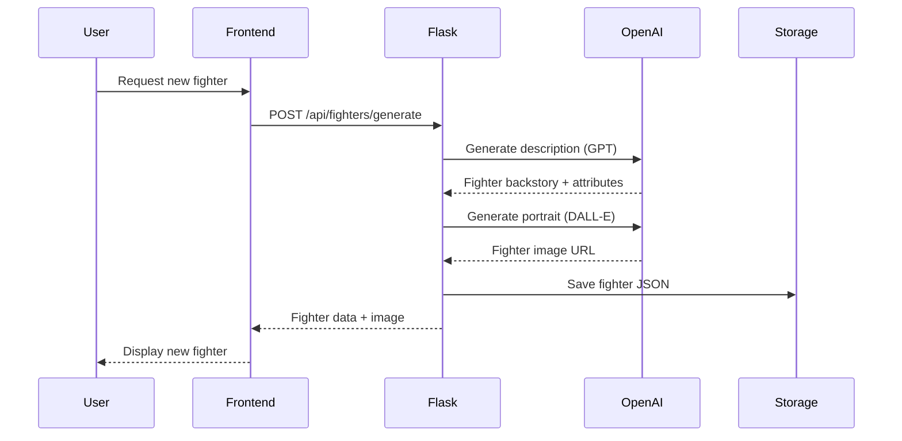
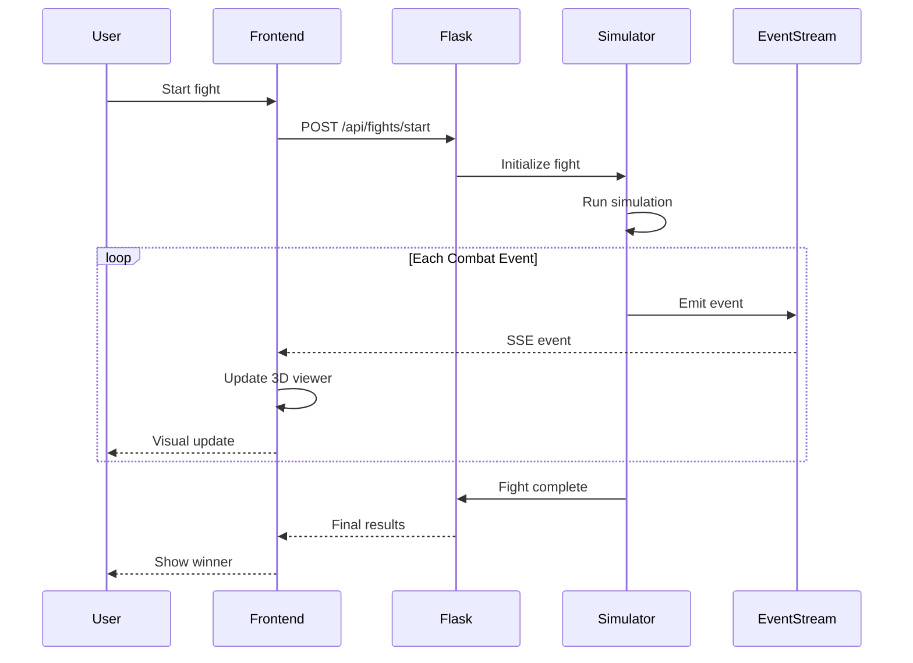
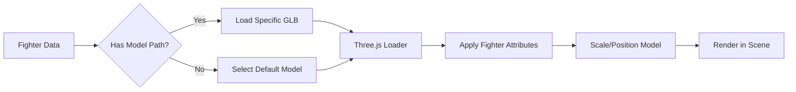

# Combat Protocol - System Documentation

**Version:** 0.2.11+  
**Last Updated:** January 28, 2026
**Author:** Jon Goldman  
**Project URL:** https://combatprotocol.com

---

## Table of Contents

1. [Executive Summary](#executive-summary)
2. [System Overview](#system-overview)
3. [Architecture](#architecture)
4. [Technology Stack](#technology-stack)
5. [Core Components](#core-components)
6. [Data Flow](#data-flow)
7. [Key Features](#key-features)
8. [Development History](#development-history)
9. [Deployment](#deployment)
10. [Appendix A: Complete Source File Inventory](#appendix-a-complete-source-file-inventory)

---

## Executive Summary

**Combat Protocol** is a physics-based multi-genre combat sports simulation deployed as a web application. The system supports multiple combat disciplines including MMA, Boxing, Muay Thai, and Brazilian Jiu-Jitsu (BJJ), with plans for expansion to additional combat sports. The platform combines deterministic combat mechanics with AI-generated fighter creation and real-time 3D visualization to deliver an engaging fighting game experience across diverse combat styles. 

The application evolved from a text-based terminal simulator into a full-stack web application featuring:
- AI-powered custom fighter generation using LLM and image generation APIs
- Real-time fight streaming using Server-Sent Events (SSE)
- 3D fighter visualization using Three.js
- Deterministic physics engine with collision detection
- RESTful API backend built with Flask/Python
- Modern React frontend with Vite build tooling

---

## System Overview

### What is Combat Protocol?

Combat Protocol is a turn-based multi-genre combat sports simulator that models realistic fight physics across multiple disciplines including MMA, Boxing, Muay Thai, and Brazilian Jiu-Jitsu. The system features:

- **Collision Detection:** Capsule-based collision system for strikes, blocks, and clinches
- **Physics Simulation:** Deterministic combat mechanics with stamina, damage, and positioning
- **Fighter AI:** Procedurally generated fighters with unique attributes and fighting styles
- **Visual Representation:** Real-time 3D rendering of fighters and combat actions
- **Event Streaming:** Live fight updates delivered to the frontend via SSE

### Supported Combat Genres

Combat Protocol currently supports four distinct combat sports disciplines, each with unique characteristics and appeal:

| Genre | Primary Appeal | Growth Driver | Primary Region |
|-------|----------------|---------------|----------------|
| **MMA** | High Versatility / Action | Global Streaming / Gen Z Reach | Global |
| **Boxing** | Heritage / Star Power | Mega-Events / Influencer Crossovers | Americas / UK |
| **Muay Thai** | High-Intensity Striking | Pan-Asian Promotions (ONE) | SE Asia / Global |
| **BJJ** | Technical Problem Solving | Adult Fitness / Lifestyle Branding | Brazil / USA |

Each genre features:
- **Genre-Specific Techniques:** Unique movesets and strategies per discipline
- **Ruleset Variations:** Different scoring, round structures, and victory conditions
- **Fighter Attributes:** Specialized stats relevant to each combat sport
- **Visual Styling:** Genre-appropriate 3D models, animations, and presentation
- **AI Generation:** LLM-powered fighter creation tailored to each discipline's culture and fighting style

The architecture is designed for extensibility, allowing additional combat genres to be added as the platform evolves.

### Use Cases

- **Entertainment:** Watch AI fighters battle across multiple combat disciplines
- **Fighter Creation:** Generate custom fighters with AI-powered descriptions and portraits for any genre
- **Combat Analysis:** Study fight statistics, damage patterns, and tactical decisions across different combat sports
- **Genre Exploration:** Experience and compare different combat sports mechanics and strategies
- **Development Platform:** Extensible architecture for adding new combat mechanics, genres, and features

---

## Architecture

### High-Level Architecture

```mermaid
graph TB
    subgraph "Frontend (React + Vite)"
        UI[User Interface]
        FC[Fighter Card Component]
        FS[Fight Simulator Component]
        TV[Three.js 3D Viewer]
        API_CLIENT[API Client]
    end
    
    subgraph "Backend (Flask + Python)"
        FLASK[Flask Application]
        FG[Fighter Generator]
        SIM[Combat Simulator]
        EVENTS[Event System]
        RENDER[Renderer]
    end
    
    subgraph "External Services"
        OPENAI[OpenAI API]
        DALLE[DALL-E Image Gen]
    end
    
    subgraph "Data Storage"
        FIGHTERS[Fighter JSON Files]
        MODELS[3D Models (GLB)]
    end
    
    UI --> API_CLIENT
    API_CLIENT -->|REST API| FLASK
    FLASK --> FG
    FLASK --> SIM
    FLASK --> EVENTS
    FG -->|Generate| OPENAI
    FG -->|Generate Portrait| DALLE
    FG -->|Save| FIGHTERS
    SIM -->|Load| FIGHTERS
    SIM --> RENDER
    EVENTS -->|SSE Stream| FS
    FS --> TV
    TV -->|Load| MODELS
```

### System Components

| Component | Technology | Purpose |
|-----------|------------|---------|
| **Frontend** | React 18 + Vite | Single-page application UI |
| **Backend** | Flask (Python) | REST API and SSE server |
| **3D Rendering** | Three.js | WebGL-based fighter visualization |
| **AI Generation** | OpenAI API | Fighter descriptions and portraits |
| **Physics Engine** | Custom Python | Deterministic combat simulation |
| **Event System** | Server-Sent Events | Real-time fight updates |

---

## Technology Stack

### Backend Stack

```
Python 3.x
├── Flask (Web framework)
├── Flask-CORS (Cross-origin support)
├── OpenAI Python SDK (AI integration)
├── NumPy (Physics calculations)
└── JSON (Data persistence)
```

### Frontend Stack

```
Node.js / npm
├── React 18.x (UI framework)
├── Vite (Build tool and dev server)
├── Three.js (3D graphics)
├── CSS3 (Styling)
└── ESLint (Code quality)
```

### Deployment Stack

```
Production Environment
├── Backend: Flask server (combatprotocol.com)
├── Frontend: Static hosting via Vite build
├── Assets: 3D models served statically
└── API: RESTful endpoints + SSE streaming
```

---

## Core Components

### 1. Fighter System

**Files:** `fighter.py`, `fighter_generator.py`

The fighter system manages fighter attributes, state, and behavior across multiple combat genres:

- **Core Attributes:** Strength, speed, endurance, technique, aggression, defense
- **Physical Properties:** Height, weight, reach, stance
- **Genre Specialization:** Combat sport discipline (MMA, Boxing, Muay Thai, BJJ)
- **Fighting Style:** Generated personality and genre-appropriate combat approach
- **State Management:** Health, stamina, position, orientation
- **AI Generation:** LLM-generated backstories and DALL-E portraits tailored to each combat genre

### 2. Combat Simulator

**Files:** `simulator.py`, `simulator_v2.py`

The physics engine processes combat mechanics with genre-specific rules:

- **Turn-Based System:** Discrete time steps for deterministic behavior
- **Genre-Specific Actions:** Move selection based on combat discipline (strikes, grappling, submissions, etc.)
- **Action Selection:** AI-driven decision making based on fighter attributes and genre
- **Collision Detection:** Capsule geometry for strike/block/grappling resolution
- **Damage Calculation:** Physics-based damage modeling with stamina costs
- **Ruleset Implementation:** Genre-appropriate scoring, rounds, and victory conditions
- **Event Generation:** Detailed combat events for visualization

### 3. Event System

**Files:** `events.py`

Manages real-time fight updates:

- **Event Types:** Strikes, blocks, dodges, clinches, round changes
- **SSE Streaming:** Server-Sent Events for live updates
- **Event Queue:** Buffered event delivery to frontend
- **Metadata:** Timestamps, positions, damage values

### 4. Rendering System

**Files:** `renderer.py`, `renderer_2d.py`, `display.py`

Visualization components:

- **Terminal Renderer:** ASCII-based fight display (legacy)
- **2D Renderer:** Matplotlib-based visualization (development)
- **3D Viewer (Frontend):** Three.js WebGL rendering

### 5. Frontend Application

**Files:** `App.jsx`, `FightSimulator.jsx`, `ThreeJsViewer.jsx`, `FighterCard.jsx`

React-based user interface:

- **Fighter Management:** Browse, select, and create fighters
- **Fight Simulation:** Initiate and watch fights in real-time
- **3D Visualization:** Dynamic fighter models with animation
- **API Integration:** RESTful calls and SSE consumption

---

## Data Flow

### Fighter Creation Flow



### Fight Execution Flow



### 3D Model Loading Flow



---

## Key Features

### 1. Multi-Genre Combat Sports Platform

- **Four Initial Disciplines:** MMA, Boxing, Muay Thai, and Brazilian Jiu-Jitsu
- **Genre-Specific Mechanics:** Each combat sport has unique techniques, rules, and strategies
- **Unified Architecture:** Consistent physics engine with genre-specific adaptations
- **Extensible Design:** Framework supports addition of new combat sports
- **Cultural Authenticity:** Fighter generation respects each genre's traditions and regional characteristics

### 2. AI-Powered Fighter Generation

- **LLM Integration:** OpenAI GPT generates fighter personalities, backstories, and attributes
- **Image Generation:** DALL-E creates unique fighter portraits
- **Attribute Synthesis:** Coherent fighting stats derived from descriptions
- **Genre-Aware Generation:** Fighters tailored to their combat discipline's culture and style
- **Persistent Storage:** Fighters saved as JSON for reuse

### 3. Deterministic Physics Engine

- **Reproducible Fights:** Same fighters produce same results
- **Capsule Collision:** 3D collision detection for strikes and blocks
- **Stamina System:** Energy management affects performance
- **Position Tracking:** 3D spatial awareness for range and angles

### 4. Real-Time 3D Visualization

- **Three.js Integration:** WebGL rendering of fighters
- **Dynamic Models:** Fighters load different 3D models based on attributes
- **Animation System:** Real-time updates during combat
- **Camera Control:** Interactive viewing angles

### 5. Event-Driven Architecture

- **Server-Sent Events:** Low-latency fight updates
- **Event Types:** Comprehensive combat action taxonomy
- **Buffered Delivery:** Reliable event streaming
- **Frontend Synchronization:** 3D view updates match simulator state

### 6. RESTful API

- **Fighter Endpoints:** CRUD operations for fighters
- **Fight Endpoints:** Initiate and control fights
- **Streaming Endpoints:** SSE connections for live updates
- **CORS Support:** Cross-origin requests enabled

---

## Development History

### Phase 1: Terminal Simulator (v0.1)
- Text-based combat simulation
- ASCII visualization
- Basic physics engine
- Fighter attribute system

### Phase 2: Web Backend (v0.2)
- Flask application framework
- REST API implementation
- Fighter generator with AI
- JSON data persistence

### Phase 3: Frontend Development (v0.2.5)
- React application scaffolding
- Vite build configuration
- Fighter card UI components
- API integration layer

### Phase 4: Real-Time Events (v0.2.6)
- Server-Sent Events implementation
- Live fight streaming
- Event buffering and delivery
- Frontend event consumption

### Phase 5: 3D Visualization (v0.2.7-0.2.9)
- Three.js integration
- Dynamic 3D model loading
- Collision detection refinement
- Enhanced physics (capsule geometry)
- Fist bump mechanics

### Current Phase: Production Deployment & Multi-Genre Expansion
- combatprotocol.com hosting
- Multi-genre support: MMA, Boxing, Muay Thai, BJJ
- Genre-specific fighter generation
- API/frontend coordination
- Performance optimization
- Bug fixes and refinements

---

## Deployment

### Backend Deployment

**Server:** Flask application running on production server  
**URL:** https://combatprotocol.com (backend API)  
**Port:** Standard HTTP/HTTPS  
**Static Assets:** Served from `/static` directory

### Frontend Deployment

**Build Tool:** Vite production build  
**Output:** `combat-protocol-frontend/dist/`  
**Deployment:** Static files copied to backend `static/v2/`  
**Access URL:** https://combatprotocol.com/

### Environment Configuration

The API client (`api.js`) handles environment-aware endpoint configuration:
- **Development:** `http://localhost:5000`
- **Production:** `https://combatprotocol.com`

---

## Appendix A: Complete Source File Inventory

### File Naming Convention
- Paths shown relative to project root
- Format: `component/path/filename.ext`

| FILE NAME | DESCRIPTION | NOTES |
|-----------|-------------|-------|
| `combat-protocol-backend/app.py` | Main Flask application entry point with API routes | Current production version |
| `combat-protocol-backend/app_v1.py` | Legacy Flask application | Preserved for reference |
| `combat-protocol-backend/data/fighters/big_buddha_boonsri.json` | Fighter data file for Big Buddha Boonsri | Generated fighter |
| `combat-protocol-backend/data/fighters/big_dude.json` | Fighter data file | Generated fighter |
| `combat-protocol-backend/data/fighters/big_mike.json` | Fighter data file for Big Mike | Generated fighter |
| `combat-protocol-backend/data/fighters/magnus_eriksson.json` | Fighter data file | Generated fighter |
| `combat-protocol-backend/data/fighters/magnus_the_mountain_erikson.json` | Fighter data file for Magnus "The Mountain" Erikson | Generated fighter |
| `combat-protocol-backend/data/fighters/marcus_big_hands_thompson.json` | Fighter data file | Generated fighter |
| `combat-protocol-backend/data/fighters/marcus_mountain_rodriguez.json` | Fighter data file | Generated fighter |
| `combat-protocol-backend/data/fighters/marcus_sledgehammer_thompson.json` | Fighter data file for Marcus "Sledgehammer" Thompson | Generated fighter |
| `combat-protocol-backend/data/fighters/marcus_sullivan.json` | Fighter data file | Generated fighter |
| `combat-protocol-backend/data/fighters/marcus_the_mountain_thompson.json` | Fighter data file for Marcus "The Mountain" Thompson | Generated fighter |
| `combat-protocol-backend/data/fighters/marcus_thompson.json` | Fighter data file for Marcus Thompson | Generated fighter |
| `combat-protocol-backend/data/fighters/marcus_thunder_fists_johnson.json` | Fighter data file for Marcus "Thunder Fists" Johnson | Generated fighter |
| `combat-protocol-backend/data/fighters/marcus_thunder.json` | Fighter data file for Marcus Thunder | Generated fighter |
| `combat-protocol-backend/data/fighters/master_liu_wei.json` | Fighter data file for Master Liu Wei | Generated fighter |
| `combat-protocol-backend/data/fighters/nongo.json` | Fighter data file for Nongo | Generated fighter |
| `combat-protocol-backend/data/fighters/rafael_martelo_santos.json` | Fighter data file for Rafael "Martelo" Santos | Generated fighter |
| `combat-protocol-backend/data/fighters/somchai.json` | Fighter data file for Somchai | Generated fighter |
| `combat-protocol-backend/data/fighters/somchai_ruangsri.json` | Fighter data file for Somchai Ruangsri | Generated fighter |
| `combat-protocol-backend/data/fighters/takeshi_yamamoto.json` | Fighter data file for Takeshi Yamamoto | Generated fighter |
| `combat-protocol-backend/data/fighters/tommy_wire_chen.json` | Fighter data file for Tommy "Wire" Chen | Generated fighter |
| `combat-protocol-backend/data/fighters/valeria_cruz.json` | Fighter data file for Valeria Cruz | Generated fighter |
| `combat-protocol-backend/data/fighters/valeria_santos.json` | Fighter data file for Valeria Santos | Generated fighter |
| `combat-protocol-backend/data/fighters/valeria_the_storm_santos.json` | Fighter data file for Valeria "The Storm" Santos | Generated fighter |
| `combat-protocol-backend/data/fighters/viktor_volkov.json` | Fighter data file for Viktor Volkov | Generated fighter |
| `combat-protocol-backend/debugging/test_events.py` | Unit tests for event system | Development testing |
| `combat-protocol-backend/debugging/test_fighter_gen.py` | Unit tests for fighter generator | Development testing |
| `combat-protocol-backend/debugging/test_fighter.py` | Unit tests for fighter class | Development testing |
| `combat-protocol-backend/debugging/test_match.py` | Integration tests for match simulation | Development testing |
| `combat-protocol-backend/display.py` | Terminal display utilities for fight visualization | Legacy rendering |
| `combat-protocol-backend/documentation/ARCHITECTURE_DIAGRAM.md` | System architecture documentation | Design reference |
| `combat-protocol-backend/documentation/CAPSULE_COLLISION_v0.2.8.md` | Documentation for capsule collision system implementation | Version 0.2.8 feature |
| `combat-protocol-backend/documentation/COLLISION_DETECTION_v0.2.6_SUMMARY.md` | Summary of collision detection system | Version 0.2.6 feature |
| `combat-protocol-backend/documentation/EVENTS_UPDATE_NEEDED.md` | Notes on required event system updates | TODO document |
| `combat-protocol-backend/documentation/FIST_BUMP_IMPLEMENTATION_v0.2.9.md` | Documentation for fist bump mechanic | Version 0.2.9 feature |
| `combat-protocol-backend/documentation/INTEGRATION_GUIDE.md` | Guide for integrating backend with frontend | Developer reference |
| `combat-protocol-backend/documentation/INTEGRATION_SNIPPETS.md` | Code snippets for common integration patterns | Developer reference |
| `combat-protocol-backend/documentation/KNOWN_ISSUES.md` | List of known bugs and issues | Issue tracking |
| `combat-protocol-backend/documentation/LOGIN_PROTECTION_SETUP.md` | Guide for implementing authentication | Security documentation |
| `combat-protocol-backend/events.py` | Event system for real-time fight updates | Core component |
| `combat-protocol-backend/fighter_generator.py` | AI-powered fighter generation using OpenAI APIs | Core component |
| `combat-protocol-backend/fighter.py` | Fighter class definition with attributes and methods | Core data model |
| `combat-protocol-backend/GETTING_STARTED.md` | Quick start guide for developers | Setup documentation |
| `combat-protocol-backend/.git-commit-template.txt` | Git commit message template | Development tool |
| `combat-protocol-backend/README-github.txt` | GitHub repository README | Project overview |
| `combat-protocol-backend/README.md` | Main project README | Project overview |
| `combat-protocol-backend/renderer_2d.py` | 2D matplotlib-based renderer | Development tool |
| `combat-protocol-backend/renderer.py` | Abstract renderer interface | Core component |
| `combat-protocol-backend/requirements.txt` | Python package dependencies | Deployment config |
| `combat-protocol-backend/run_terminal_fight.py` | Command-line interface for running fights | Development tool |
| `combat-protocol-backend/simulator.py` | Main combat simulation engine | Core component |
| `combat-protocol-backend/simulator_v2.py` | Enhanced simulation engine | Core component |
| `combat-protocol-backend/static/demos/fighter_3d_demo.html` | Demo page for 3D fighter visualization | Development demo |
| `combat-protocol-backend/static/demos/fighter_3d_enhanced.html` | Enhanced 3D demo with improved rendering | Development demo |
| `combat-protocol-backend/static/demos/fighter_full_detail2.html` | Detailed 3D fighter demo (version 2) | Development demo |
| `combat-protocol-backend/static/demos/fighter_full_detail3.html` | Detailed 3D fighter demo (version 3) | Development demo |
| `combat-protocol-backend/static/demos/fighter_full_detail.html` | Detailed 3D fighter demo | Development demo |
| `combat-protocol-backend/static/demos/fighter_improved_geometry.html` | Demo with improved collision geometry | Development demo |
| `combat-protocol-backend/static/demos/fighter_realistic.html` | Realistic fighter rendering demo | Development demo |
| `combat-protocol-backend/static/models/model_library.json` | 3D model library configuration | Asset manifest |
| `combat-protocol-backend/static/v2/assets/index-C9PSHE87.js` | Built frontend JavaScript bundle | Vite production build |
| `combat-protocol-backend/static/v2/assets/index-D2kM0sZD.css` | Built frontend CSS bundle | Vite production build |
| `combat-protocol-backend/static/v2/assets/index-DbyElBsw.js` | Built frontend JavaScript bundle (alternate) | Vite production build |
| `combat-protocol-backend/static/v2/index.html` | Production frontend entry point | Vite production build |
| `combat-protocol-backend/templates/index.html` | Flask template for main application page | Server-rendered template |
| `combat-protocol-backend/templates/index_v1.html` | Legacy Flask template | Preserved for reference |
| `combat-protocol-backend/templates/index_with_dynamic_models.html` | Template with dynamic 3D model loading | Development template |
| `combat-protocol-backend/templates/model_test.html` | Template for testing 3D models | Development template |
| `combat-protocol-backend/templates/test_integration.html` | Template for integration testing | Development template |
| `combat-protocol-backend/trash_talk.py` | Fighter trash talk generation system | Feature module |
| `combat-protocol-backend/utils/fbx_to_glb.py` | Utility script for converting FBX models to GLB format | Asset pipeline tool |
| `combat-protocol-backend/utils/migrate_add_models.py` | Database migration script for adding 3D model references | Migration tool |
| `combat-protocol-frontend/documentation/3D_VIEWER_SETUP.md` | Setup guide for Three.js viewer component | Developer documentation |
| `combat-protocol-frontend/eslint.config.js` | ESLint configuration for code quality | Development config |
| `combat-protocol-frontend/index.html` | Frontend application entry HTML | Vite template |
| `combat-protocol-frontend/package.json` | npm package manifest with dependencies | Build configuration |
| `combat-protocol-frontend/package-lock.json` | npm dependency lock file | Build configuration |
| `combat-protocol-frontend/README.md` | Frontend project README | Project documentation |
| `combat-protocol-frontend/src/api.js` | API client for backend communication | Core utility |
| `combat-protocol-frontend/src/App.css` | Main application stylesheet | Styling |
| `combat-protocol-frontend/src/App.jsx` | Root React component | Core component |
| `combat-protocol-frontend/src/FighterCard.css` | Stylesheet for fighter card component | Styling |
| `combat-protocol-frontend/src/FighterCard.jsx` | React component for displaying fighter information | UI component |
| `combat-protocol-frontend/src/FightSimulator.css` | Stylesheet for fight simulator component | Styling |
| `combat-protocol-frontend/src/FightSimulator.jsx` | React component for fight simulation and control | Core component |
| `combat-protocol-frontend/src/index.css` | Global stylesheet | Styling |
| `combat-protocol-frontend/src/main.jsx` | React application entry point | Application bootstrap |
| `combat-protocol-frontend/src/ThreeJsTest.jsx` | Test component for Three.js functionality | Development component |
| `combat-protocol-frontend/src/ThreeJsViewer.css` | Stylesheet for 3D viewer component | Styling |
| `combat-protocol-frontend/src/ThreeJsViewer.jsx` | React component for 3D fight visualization using Three.js | Core component |
| `combat-protocol-frontend/vite.config.js` | Vite build configuration | Build configuration |
| `TOKENS.txt` | API token storage | Configuration (sensitive) |

---

**End of Document**

*This documentation was generated on January 26, 2026 as a comprehensive system overview for Combat Protocol. For the latest updates and code changes, refer to the project repository.*
