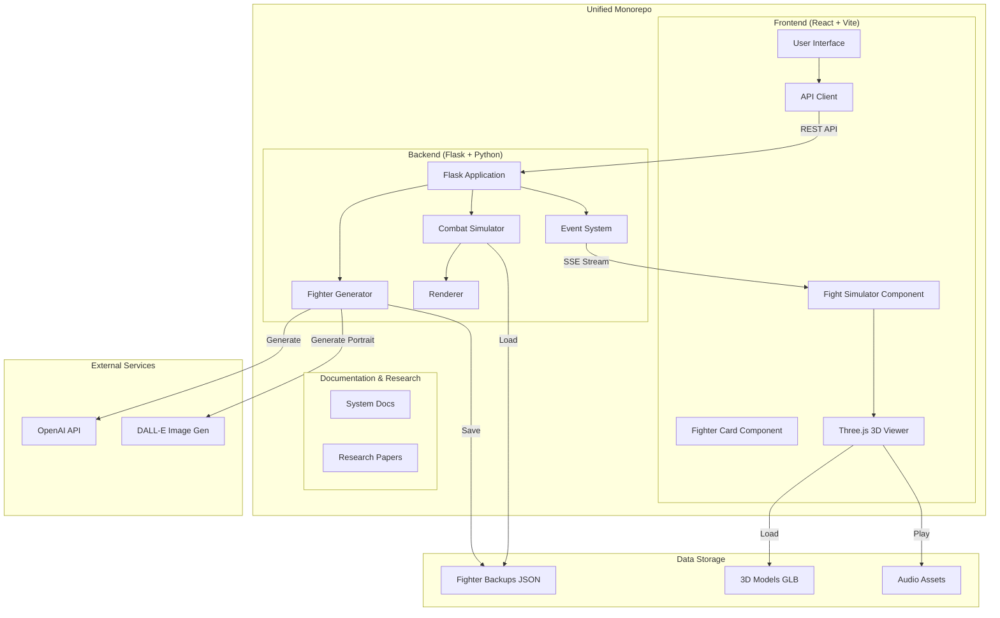
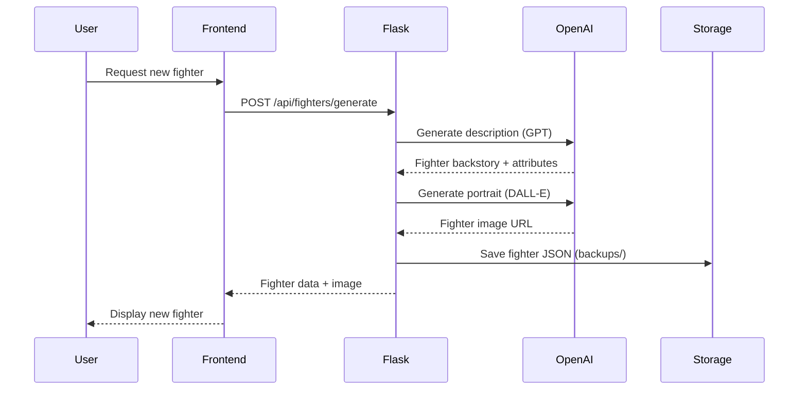
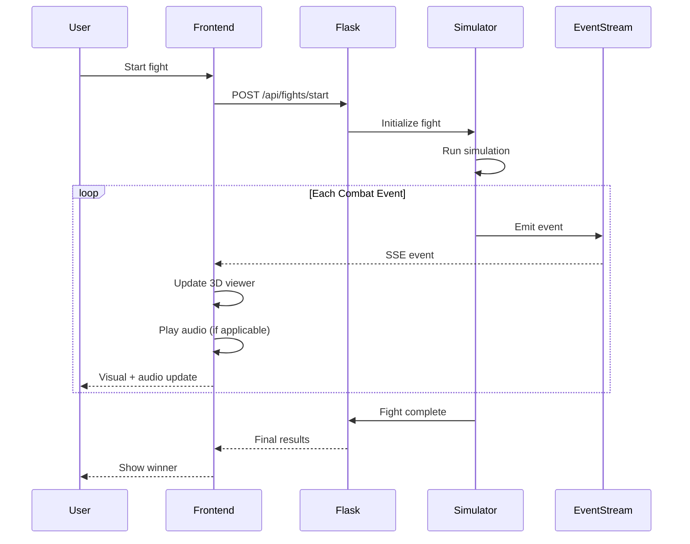
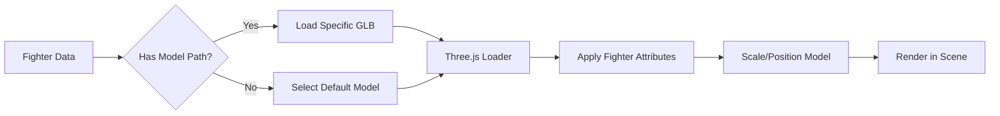

# Combat Protocol - System Documentation

**Version:** 0.2.9+  
**Last Updated:** January 27, 2026  
**Author:** Jon Goldman  
**Project URL:** https://combatprotocol.com  
**GitHub Repository:** https://github.com/jongoldman/combat-protocol

---

## Table of Contents

1. [Executive Summary](#executive-summary)
2. [System Overview](#system-overview)
3. [Repository Structure](#repository-structure)
4. [Architecture](#architecture)
5. [Technology Stack](#technology-stack)
6. [Core Components](#core-components)
7. [Data Flow](#data-flow)
8. [Key Features](#key-features)
9. [Development History](#development-history)
10. [Deployment](#deployment)
11. [Appendix A: Complete Source File Inventory](#appendix-a-complete-source-file-inventory)

---

## Executive Summary

**Combat Protocol** is a physics-based multi-genre combat sports simulation deployed as a web application. The system supports multiple combat disciplines including MMA, Boxing, Muay Thai, and Brazilian Jiu-Jitsu (BJJ), with plans for expansion to additional combat sports. The platform combines deterministic combat mechanics with AI-generated fighter creation and real-time 3D visualization to deliver an engaging fighting game experience across diverse combat styles. 

The application evolved from a text-based terminal simulator into a full-stack web application featuring:
- AI-powered custom fighter generation using LLM and image generation APIs
- Real-time fight streaming using Server-Sent Events (SSE)
- 3D fighter visualization using Three.js
- Deterministic physics engine with collision detection
- RESTful API backend built with Flask/Python
- Modern React frontend with Vite build tooling

The project is now organized as a **unified monorepo** on GitHub, consolidating frontend and backend codebases with shared documentation, research papers, and utilities.

---

## System Overview

### What is Combat Protocol?

Combat Protocol is a turn-based multi-genre combat sports simulator that models realistic fight physics across multiple disciplines including MMA, Boxing, Muay Thai, and Brazilian Jiu-Jitsu. The system features:

- **Collision Detection:** Capsule-based collision system for strikes, blocks, and clinches
- **Physics Simulation:** Deterministic combat mechanics with stamina, damage, and positioning
- **Fighter AI:** Procedurally generated fighters with unique attributes and fighting styles
- **Visual Representation:** Real-time 3D rendering of fighters and combat actions
- **Event Streaming:** Live fight updates delivered to the frontend via SSE

### Supported Combat Genres

Combat Protocol currently supports four distinct combat sports disciplines, each with unique characteristics and appeal:

| Genre | Primary Appeal | Growth Driver | Primary Region |
|-------|----------------|---------------|----------------|
| **MMA** | High Versatility / Action | Global Streaming / Gen Z Reach | Global |
| **Boxing** | Heritage / Star Power | Mega-Events / Influencer Crossovers | Americas / UK |
| **Muay Thai** | High-Intensity Striking | Pan-Asian Promotions (ONE) | SE Asia / Global |
| **BJJ** | Technical Problem Solving | Adult Fitness / Lifestyle Branding | Brazil / USA |

Each genre features:
- **Genre-Specific Techniques:** Unique movesets and strategies per discipline
- **Ruleset Variations:** Different scoring, round structures, and victory conditions
- **Fighter Attributes:** Specialized stats relevant to each combat sport
- **Visual Styling:** Genre-appropriate 3D models, animations, and presentation
- **AI Generation:** LLM-powered fighter creation tailored to each discipline's culture and fighting style

The architecture is designed for extensibility, allowing additional combat genres to be added as the platform evolves.

### Use Cases

- **Entertainment:** Watch AI fighters battle across multiple combat disciplines
- **Fighter Creation:** Generate custom fighters with AI-powered descriptions and portraits for any genre
- **Combat Analysis:** Study fight statistics, damage patterns, and tactical decisions across different combat sports
- **Genre Exploration:** Experience and compare different combat sports mechanics and strategies
- **Development Platform:** Extensible architecture for adding new combat mechanics, genres, and features

---

## Repository Structure

Combat Protocol is organized as a **unified monorepo** with the following top-level structure:

```
combat-protocol/
├── backend/              # Flask/Python backend application
├── frontend/             # React/Vite frontend application
├── docs/                 # Project documentation
├── legal/                # Legal documents and character specifications
├── papers/               # Research papers and academic references
├── scripts/              # Utility scripts for development and deployment
├── *.sh                  # Migration and setup scripts
└── README.md             # Project overview
```

### Directory Purposes

| Directory | Purpose |
|-----------|---------|
| **backend/** | Flask application with API routes, physics engine, fighter generation, and 3D assets |
| **frontend/** | React single-page application with Three.js visualization |
| **docs/** | Comprehensive system documentation including architecture and git history |
| **legal/** | Character specification schemas and content filtering scripts |
| **papers/** | Academic research papers relevant to combat sports pose estimation and physics |
| **scripts/** | Automation scripts for git operations, deployment, and maintenance |

---

## Architecture

### High-Level Architecture



### System Components

| Component | Technology | Purpose |
|-----------|------------|---------|
| **Frontend** | React 18 + Vite | Single-page application UI |
| **Backend** | Flask (Python) | REST API and SSE server |
| **3D Rendering** | Three.js | WebGL-based fighter visualization |
| **AI Generation** | OpenAI API | Fighter descriptions and portraits |
| **Physics Engine** | Custom Python | Deterministic combat simulation |
| **Event System** | Server-Sent Events | Real-time fight updates |
| **Audio System** | HTML5 Audio | Combat sound effects |

---

## Technology Stack

### Backend Stack

```
Python 3.x
├── Flask (Web framework)
├── Flask-CORS (Cross-origin support)
├── OpenAI Python SDK (AI integration)
├── NumPy (Physics calculations)
└── JSON (Data persistence)
```

### Frontend Stack

```
Node.js / npm
├── React 18.x (UI framework)
├── Vite (Build tool and dev server)
├── Three.js (3D graphics)
├── CSS3 (Styling)
└── ESLint (Code quality)
```

### Deployment Stack

```
Production Environment
├── Backend: Flask server (combatprotocol.com)
├── Frontend: Static hosting via Vite build
├── Assets: 3D models and audio served statically
├── API: RESTful endpoints + SSE streaming
└── Deployment: Heroku/Render (via Procfile)
```

---

## Core Components

### 1. Fighter System

**Files:** `backend/fighter.py`, `backend/fighter_generator.py`

The fighter system manages fighter attributes, state, and behavior across multiple combat genres:

- **Core Attributes:** Strength, speed, endurance, technique, aggression, defense
- **Physical Properties:** Height, weight, reach, stance
- **Genre Specialization:** Combat sport discipline (MMA, Boxing, Muay Thai, BJJ)
- **Fighting Style:** Generated personality and genre-appropriate combat approach
- **State Management:** Health, stamina, position, orientation
- **AI Generation:** LLM-generated backstories and DALL-E portraits tailored to each combat genre
- **Persistence:** Fighter data stored as JSON in `backend/backups/`

### 2. Combat Simulator

**Files:** `backend/simulator.py`, `backend/simulator_v2.py`

The physics engine processes combat mechanics with genre-specific rules:

- **Turn-Based System:** Discrete time steps for deterministic behavior
- **Genre-Specific Actions:** Move selection based on combat discipline (strikes, grappling, submissions, etc.)
- **Action Selection:** AI-driven decision making based on fighter attributes and genre
- **Collision Detection:** Capsule geometry for strike/block/grappling resolution
- **Damage Calculation:** Physics-based damage modeling with stamina costs
- **Ruleset Implementation:** Genre-appropriate scoring, rounds, and victory conditions
- **Event Generation:** Detailed combat events for visualization

### 3. Event System

**Files:** `backend/events.py`

Manages real-time fight updates:

- **Event Types:** Strikes, blocks, dodges, clinches, round changes
- **SSE Streaming:** Server-Sent Events for live updates
- **Event Queue:** Buffered event delivery to frontend
- **Metadata:** Timestamps, positions, damage values

### 4. Rendering System

**Files:** `backend/renderer.py`, `backend/renderer_2d.py`, `backend/display.py`

Visualization components:

- **Terminal Renderer:** ASCII-based fight display (legacy)
- **2D Renderer:** Matplotlib-based visualization (development)
- **3D Viewer (Frontend):** Three.js WebGL rendering

### 5. Frontend Application

**Files:** `frontend/src/App.jsx`, `frontend/src/FightSimulator.jsx`, `frontend/src/ThreeJsViewer.jsx`, `frontend/src/FighterCard.jsx`

React-based user interface:

- **Fighter Management:** Browse, select, and create fighters
- **Fight Simulation:** Initiate and watch fights in real-time
- **3D Visualization:** Dynamic fighter models with animation
- **Audio Integration:** Combat sound effects (fist bumps, impacts)
- **API Integration:** RESTful calls and SSE consumption

### 6. 3D Asset Pipeline

**Files:** `backend/static/models/*.glb`, `backend/utils/fbx_to_glb.py`

3D model management:

- **Model Library:** Collection of GLB format 3D models
- **Animation Types:** Boxing, punching, kicks, blocks, taunts
- **Format Conversion:** FBX to GLB converter utility
- **Dynamic Loading:** Models selected based on fighter attributes and actions

### 7. Audio System

**Files:** `backend/static/sounds/fist_bump.mp3`

Combat audio effects:

- **Fist Bump Audio:** Pre-fight ritual sound effect
- **HTML5 Integration:** Frontend plays sounds via Audio API
- **Extensibility:** Framework for additional combat sounds

---

## Data Flow

### Fighter Creation Flow



### Fight Execution Flow



### 3D Model Loading Flow



---

## Key Features

### 1. Multi-Genre Combat Sports Platform

- **Four Initial Disciplines:** MMA, Boxing, Muay Thai, and Brazilian Jiu-Jitsu
- **Genre-Specific Mechanics:** Each combat sport has unique techniques, rules, and strategies
- **Unified Architecture:** Consistent physics engine with genre-specific adaptations
- **Extensible Design:** Framework supports addition of new combat sports
- **Cultural Authenticity:** Fighter generation respects each genre's traditions and regional characteristics

### 2. AI-Powered Fighter Generation

- **LLM Integration:** OpenAI GPT generates fighter personalities, backstories, and attributes
- **Image Generation:** DALL-E creates unique fighter portraits
- **Attribute Synthesis:** Coherent fighting stats derived from descriptions
- **Genre-Aware Generation:** Fighters tailored to their combat discipline's culture and style
- **Persistent Storage:** Fighters saved as JSON for reuse

### 3. Deterministic Physics Engine

- **Reproducible Fights:** Same fighters produce same results
- **Capsule Collision:** 3D collision detection for strikes and blocks
- **Stamina System:** Energy management affects performance
- **Position Tracking:** 3D spatial awareness for range and angles

### 4. Real-Time 3D Visualization

- **Three.js Integration:** WebGL rendering of fighters
- **Dynamic Models:** Fighters load different 3D models based on attributes
- **Animation System:** Real-time updates during combat
- **Camera Control:** Interactive viewing angles
- **Rich Model Library:** Multiple GLB models for different actions and styles

### 5. Event-Driven Architecture

- **Server-Sent Events:** Low-latency fight updates
- **Event Types:** Comprehensive combat action taxonomy
- **Buffered Delivery:** Reliable event streaming
- **Frontend Synchronization:** 3D view updates match simulator state

### 6. RESTful API

- **Fighter Endpoints:** CRUD operations for fighters
- **Fight Endpoints:** Initiate and control fights
- **Streaming Endpoints:** SSE connections for live updates
- **CORS Support:** Cross-origin requests enabled

### 7. Unified Monorepo Structure

- **Consolidated Codebase:** Frontend and backend in single repository
- **Shared Documentation:** Centralized docs for architecture and development
- **Research Integration:** Academic papers included for reference
- **Migration Scripts:** Tools for repository management and deployment

---

## Development History

### Phase 1: Terminal Simulator (v0.1)
- Text-based combat simulation
- ASCII visualization
- Basic physics engine
- Fighter attribute system

### Phase 2: Web Backend (v0.2)
- Flask application framework
- REST API implementation
- Fighter generator with AI
- JSON data persistence

### Phase 3: Frontend Development (v0.2.5)
- React application scaffolding
- Vite build configuration
- Fighter card UI components
- API integration layer

### Phase 4: Real-Time Events (v0.2.6)
- Server-Sent Events implementation
- Live fight streaming
- Event buffering and delivery
- Frontend event consumption

### Phase 5: 3D Visualization (v0.2.7-0.2.9)
- Three.js integration
- Dynamic 3D model loading
- Collision detection refinement
- Enhanced physics (capsule geometry)
- Fist bump mechanics with audio
- Multiple animation GLB models

### Phase 6: Monorepo Unification (Current)
- Unified repository structure
- Frontend/backend consolidation
- Documentation centralization
- Research paper integration
- Character specification system
- Migration tooling

### Current Phase: Production Deployment & Multi-Genre Expansion
- combatprotocol.com hosting
- Multi-genre support: MMA, Boxing, Muay Thai, BJJ
- Genre-specific fighter generation
- API/frontend coordination
- Performance optimization
- Bug fixes and refinements

---

## Deployment

### Backend Deployment

**Server:** Flask application running on production server  
**URL:** https://combatprotocol.com (backend API)  
**Port:** Standard HTTP/HTTPS  
**Static Assets:** Served from `/static` directory  
**Deployment Config:** `backend/Procfile` for platform deployment

### Frontend Deployment

**Build Tool:** Vite production build  
**Output:** `frontend/dist/`  
**Deployment:** Static files copied to backend `static/v2/`  
**Access URL:** https://combatprotocol.com/

### Environment Configuration

The API client (`frontend/src/api.js`) handles environment-aware endpoint configuration:
- **Development:** `http://localhost:5000`
- **Production:** `https://combatprotocol.com`

### Version Control

**Repository:** https://github.com/jongoldman/combat-protocol  
**Structure:** Unified monorepo with frontend and backend  
**Branches:** Main branch for production, feature branches for development

---

## Appendix A: Complete Source File Inventory

### File Naming Convention
- Paths shown relative to project root
- Format: `directory/path/filename.ext`

| FILE NAME | DESCRIPTION | NOTES |
|-----------|-------------|-------|
| **Root Level** | | |
| `README.md` | Main project README and overview | Project entry point |
| `complete-migration.sh` | Script for completing repository migration to monorepo | Migration tool |
| `export-git-history.sh` | Script for exporting git history during migration | Migration tool |
| `migrate-to-monorepo.sh` | Main monorepo migration script | Migration tool |
| **Backend Application** | | |
| `backend/app.py` | Main Flask application entry point with API routes | Current production version |
| `backend/app_v1.py` | Legacy Flask application | Preserved for reference |
| `backend/display.py` | Terminal display utilities for fight visualization | Legacy rendering |
| `backend/events.py` | Event system for real-time fight updates | Core component |
| `backend/fighter_generator.py` | AI-powered fighter generation using OpenAI APIs | Core component |
| `backend/fighter.py` | Fighter class definition with attributes and methods | Core data model |
| `backend/renderer_2d.py` | 2D matplotlib-based renderer | Development tool |
| `backend/renderer.py` | Abstract renderer interface | Core component |
| `backend/run_terminal_fight.py` | Command-line interface for running fights | Development tool |
| `backend/simulator.py` | Main combat simulation engine | Core component |
| `backend/simulator_v2.py` | Enhanced simulation engine | Core component |
| `backend/trash_talk.py` | Fighter trash talk generation system | Feature module |
| `backend/Procfile` | Deployment configuration for platform hosting | Deployment config |
| `backend/requirements.txt` | Python package dependencies | Deployment config |
| `backend/GETTING_STARTED.md` | Quick start guide for developers | Setup documentation |
| `backend/README-github.txt` | GitHub repository README | Project overview |
| `backend/README.md` | Backend project README | Component documentation |
| **Backend Backups** | | |
| `backend/backups/big_d_20260115_155627.json` | Fighter backup: Big D | Timestamped backup |
| `backend/backups/big_dave_20260115_155629.json` | Fighter backup: Big Dave | Timestamped backup |
| `backend/backups/big_dude_20260115_155633.json` | Fighter backup: Big Dude | Timestamped backup |
| `backend/backups/big_strong_fighter_20260115_155631.json` | Fighter backup: Big Strong Fighter | Timestamped backup |
| `backend/backups/jake_razor_mitchell_20260115_155627.json` | Fighter backup: Jake "Razor" Mitchell | Timestamped backup |
| `backend/backups/jake_razor_morrison_20260115_155632.json` | Fighter backup: Jake "Razor" Morrison | Timestamped backup |
| `backend/backups/jake_razor_thompson_20260115_155632.json` | Fighter backup: Jake "Razor" Thompson | Timestamped backup |
| `backend/backups/joseph_ravenfeather_20260115_155628.json` | Fighter backup: Joseph Ravenfeather | Timestamped backup |
| `backend/backups/marcus_the_mountain_thompson_20260115_155630.json` | Fighter backup: Marcus "The Mountain" Thompson | Timestamped backup |
| `backend/backups/marcus_thompson_20260115_155628.json` | Fighter backup: Marcus Thompson | Timestamped backup |
| `backend/backups/mia_thompson_20260115_155633.json` | Fighter backup: Mia Thompson | Timestamped backup |
| `backend/backups/nongo_20260115_155626.json` | Fighter backup: Nongo | Timestamped backup |
| `backend/backups/skinny_fighter_20260115_155630.json` | Fighter backup: Skinny Fighter | Timestamped backup |
| `backend/backups/somchai_20260115_155631.json` | Fighter backup: Somchai | Timestamped backup |
| `backend/backups/somchai_ruangsri_20260115_155634.json` | Fighter backup: Somchai Ruangsri | Timestamped backup |
| **Backend Debugging** | | |
| `backend/debugging/test_events.py` | Unit tests for event system | Development testing |
| `backend/debugging/test_fighter_gen.py` | Unit tests for fighter generator | Development testing |
| `backend/debugging/test_fighter.py` | Unit tests for fighter class | Development testing |
| `backend/debugging/test_match.py` | Integration tests for match simulation | Development testing |
| **Backend Documentation** | | |
| `backend/documentation/ARCHITECTURE_DIAGRAM.md` | System architecture documentation | Design reference |
| `backend/documentation/CAPSULE_COLLISION_v0.2.8.md` | Documentation for capsule collision system implementation | Version 0.2.8 feature |
| `backend/documentation/COLLISION_DETECTION_v0.2.6_SUMMARY.md` | Summary of collision detection system | Version 0.2.6 feature |
| `backend/documentation/EVENTS_UPDATE_NEEDED.md` | Notes on required event system updates | TODO document |
| `backend/documentation/FIST_BUMP_IMPLEMENTATION_v0.2.9.md` | Documentation for fist bump mechanic | Version 0.2.9 feature |
| `backend/documentation/INTEGRATION_GUIDE.md` | Guide for integrating backend with frontend | Developer reference |
| `backend/documentation/INTEGRATION_SNIPPETS.md` | Code snippets for common integration patterns | Developer reference |
| `backend/documentation/KNOWN_ISSUES.md` | List of known bugs and issues | Issue tracking |
| `backend/documentation/LOGIN_PROTECTION_SETUP.md` | Guide for implementing authentication | Security documentation |
| **Backend Static Assets - Demos** | | |
| `backend/static/demos/fighter_3d_demo.html` | Demo page for 3D fighter visualization | Development demo |
| `backend/static/demos/fighter_3d_enhanced.html` | Enhanced 3D demo with improved rendering | Development demo |
| `backend/static/demos/fighter_full_detail.html` | Detailed 3D fighter demo | Development demo |
| `backend/static/demos/fighter_full_detail2.html` | Detailed 3D fighter demo (version 2) | Development demo |
| `backend/static/demos/fighter_full_detail3.html` | Detailed 3D fighter demo (version 3) | Development demo |
| `backend/static/demos/fighter_improved_geometry.html` | Demo with improved collision geometry | Development demo |
| `backend/static/demos/fighter_realistic.html` | Realistic fighter rendering demo | Development demo |
| **Backend Static Assets - 3D Models** | | |
| `backend/static/models/model_library.json` | 3D model library configuration | Asset manifest |
| `backend/static/models/Boxing_blender.glb` | 3D model: Boxing stance/action | GLB asset |
| `backend/static/models/Boxing_with_kick.glb` | 3D model: Boxing with kick combination | GLB asset |
| `backend/static/models/Chapa-Giratoria_blender.glb` | 3D model: Spinning kick (Chapa Giratoria) | GLB asset |
| `backend/static/models/Fist Fight B_blender.glb` | 3D model: Fist fight animation variant B | GLB asset |
| `backend/static/models/Left Block_blender.glb` | 3D model: Left side block defensive move | GLB asset |
| `backend/static/models/Light Hit To Head_blender.glb` | 3D model: Light head strike animation | GLB asset |
| `backend/static/models/Punching.glb` | 3D model: Basic punching animation | GLB asset |
| `backend/static/models/Punching2.glb` | 3D model: Punching animation variant 2 | GLB asset |
| `backend/static/models/Punching_blender.glb` | 3D model: Blender-exported punching animation | GLB asset |
| `backend/static/models/Taunt_blender.glb` | 3D model: Fighter taunt animation | GLB asset |
| **Backend Static Assets - Audio** | | |
| `backend/static/sounds/fist_bump.mp3` | Audio: Fist bump sound effect | Audio asset |
| **Backend Static Assets - Production Build** | | |
| `backend/static/v2/index.html` | Production frontend entry point | Vite production build |
| `backend/static/v2/vite.svg` | Vite logo asset | Build asset |
| `backend/static/v2/assets/index-C9PSHE87.js` | Built frontend JavaScript bundle | Vite production build |
| `backend/static/v2/assets/index-D2kM0sZD.css` | Built frontend CSS bundle | Vite production build |
| `backend/static/v2/assets/index-DbyElBsw.js` | Built frontend JavaScript bundle (alternate) | Vite production build |
| **Backend Templates** | | |
| `backend/templates/index.html` | Flask template for main application page | Server-rendered template |
| `backend/templates/index_v1.html` | Legacy Flask template | Preserved for reference |
| `backend/templates/index_with_dynamic_models.html` | Template with dynamic 3D model loading | Development template |
| `backend/templates/model_test.html` | Template for testing 3D models | Development template |
| `backend/templates/test_integration.html` | Template for integration testing | Development template |
| **Backend Utilities** | | |
| `backend/utils/fbx_to_glb.py` | Utility script for converting FBX models to GLB format | Asset pipeline tool |
| `backend/utils/find-src.sh` | Shell script to find source files in project | Development utility |
| `backend/utils/migrate_add_models.py` | Database migration script for adding 3D model references | Migration tool |
| **Documentation** | | |
| `docs/COMBAT_PROTOCOL_GIT_HISTORY.md` | Git repository history and migration documentation | Repository documentation |
| `docs/COMBAT_PROTOCOL_SYSTEM_DOCUMENTATION.md` | Comprehensive system documentation (this file) | Primary documentation |
| **Frontend Application** | | |
| `frontend/index.html` | Frontend application entry HTML | Vite template |
| `frontend/package.json` | npm package manifest with dependencies | Build configuration |
| `frontend/package-lock.json` | npm dependency lock file | Build configuration |
| `frontend/README.md` | Frontend project README | Project documentation |
| `frontend/eslint.config.js` | ESLint configuration for code quality | Development config |
| `frontend/vite.config.js` | Vite build configuration | Build configuration |
| **Frontend Documentation** | | |
| `frontend/documentation/3D_VIEWER_SETUP.md` | Setup guide for Three.js viewer component | Developer documentation |
| **Frontend Public Assets** | | |
| `frontend/public/vite.svg` | Vite logo for public access | Public asset |
| **Frontend Source Code** | | |
| `frontend/src/api.js` | API client for backend communication | Core utility |
| `frontend/src/App.css` | Main application stylesheet | Styling |
| `frontend/src/App.jsx` | Root React component | Core component |
| `frontend/src/FighterCard.css` | Stylesheet for fighter card component | Styling |
| `frontend/src/FighterCard.jsx` | React component for displaying fighter information | UI component |
| `frontend/src/FightSimulator.css` | Stylesheet for fight simulator component | Styling |
| `frontend/src/FightSimulator.jsx` | React component for fight simulation and control | Core component |
| `frontend/src/index.css` | Global stylesheet | Styling |
| `frontend/src/main.jsx` | React application entry point | Application bootstrap |
| `frontend/src/ThreeJsTest.jsx` | Test component for Three.js functionality | Development component |
| `frontend/src/ThreeJsViewer.css` | Stylesheet for 3D viewer component | Styling |
| `frontend/src/ThreeJsViewer.jsx` | React component for 3D fight visualization using Three.js | Core component |
| **Frontend Source Assets** | | |
| `frontend/src/assets/react.svg` | React logo asset | Asset |
| **Legal** | | |
| `legal/character-specification-scheme.json` | JSON schema for character specifications | Legal/Content specification |
| `legal/filter-script.py` | Python script for content filtering | Content moderation tool |
| **Research Papers** | | |
| `papers/Multi-person Physics-based Pose Estimation for Combat Sports - 2504.08175v1.pdf` | Academic paper on multi-person pose estimation for combat sports | Research reference |
| **Scripts** | | |
| `scripts/git-pull.sh` | Utility script for git pull operations | Development utility |

---

**End of Document**

*This documentation was generated on January 27, 2026 as a comprehensive system overview for Combat Protocol. For the latest updates and code changes, refer to the project repository at https://github.com/jongoldman/combat-protocol*
